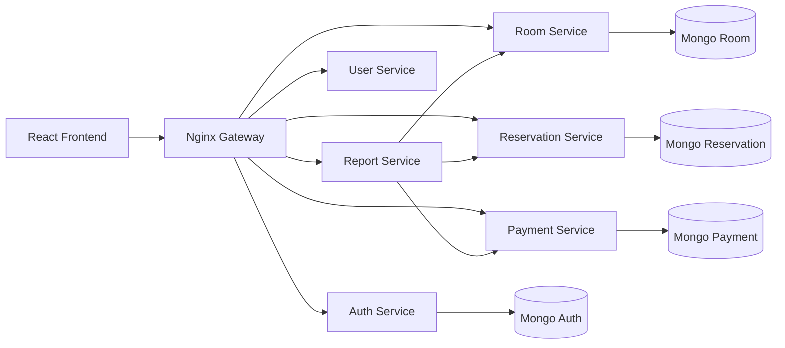

<!-- High-level architecture -->
<!-- Mermaid architecture diagram -->

```mermaid
flowchart LR

Client[React Frontend]

Gateway[Nginx Gateway]

Auth[Auth Service]
Users[User Service]
Rooms[Room Service]
Reservations[Reservation Service]
Payments[Payment Service]
Reports[Report Service]

MongoAuth[(Mongo Auth)]
MongoRoom[(Mongo Room)]
MongoReservation[(Mongo Reservation)]
MongoPayment[(Mongo Payment)]

Client --> Gateway

Gateway --> Auth
Gateway --> Users
Gateway --> Rooms
Gateway --> Reservations
Gateway --> Payments
Gateway --> Reports

Auth --> MongoAuth
Rooms --> MongoRoom
Reservations --> MongoReservation
Payments --> MongoPayment

Reports --> Reservations
Reports --> Rooms
Reports --> Payments
```