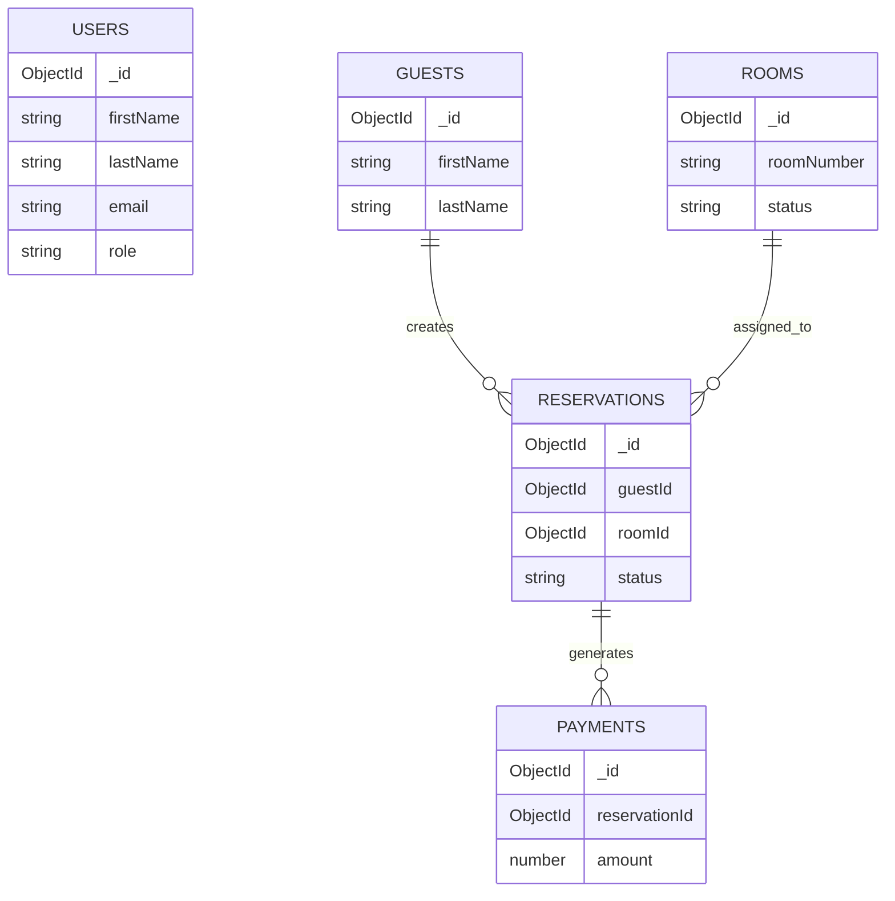

<!-- Human readable ERD -->

```mermaid
erDiagram

USERS {
  ObjectId _id
  string firstName
  string lastName
  string email
  string role
}

ROOMS {
  ObjectId _id
  string roomNumber
  string status
}

GUESTS {
  ObjectId _id
  string firstName
  string lastName
}

RESERVATIONS {
  ObjectId _id
  ObjectId guestId
  ObjectId roomId
  string status
}

PAYMENTS {
  ObjectId _id
  ObjectId reservationId
  number amount
}

GUESTS ||--o{ RESERVATIONS : creates

ROOMS ||--o{ RESERVATIONS : assigned_to

RESERVATIONS ||--o{ PAYMENTS : generates
```